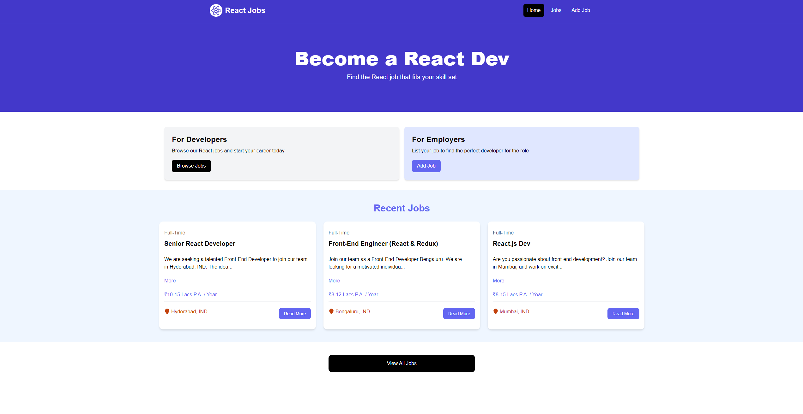

# HireQuest

HireQuest is a simple web application designed to facilitate job postings and job searching, built using React, Tailwind CSS, and JSON Server. This project serves as a learning exercise to understand the fundamentals of React and its ecosystem.



## Features

- **Job Listings**: Employers can add new job postings with relevant details.
- **Job Search**: Students can search for job opportunities and view job details.
- **Contact Information**: Access contact details for job postings.
- **CRUD Operations**: Full Create, Read, Update, and Delete functionality for job postings.

## Technologies Used

- **React**: Frontend library for building user interfaces.
- **Tailwind CSS**: Utility-first CSS framework for styling.
- **JSON Server**: Simple backend for storing and managing job data.

## Getting Started

### Prerequisites

- Node.js and npm installed on your machine.

### Install Dependencies

```bash
npm install
```

### Run JSON Server

The server will run on http://localhost:8000

```bash
npm run server
```

### Run Vite Frontend

React will run on http://localhost:3000

```bash
npm run dev
```

### Build for Production

```bash
npm run build
```

### Preview Production Build

```bash
npm run preview
```
## Usage

- **Adding Jobs**: Navigate to the 'Add Job' page to create a new job posting.
- **Searching for Jobs**: Use the search bar on the homepage to find jobs.
- **Viewing Job Details**: Click on a job listing to see more details and contact information.

## Learning Objectives

- Understanding the basics of React and component-based architecture.
- Learning how to style applications using Tailwind CSS.
- Implementing CRUD operations and managing state in a React application.
- Simulating a backend using JSON Server for development purposes.
